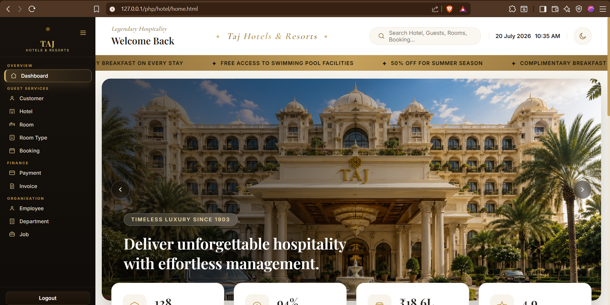
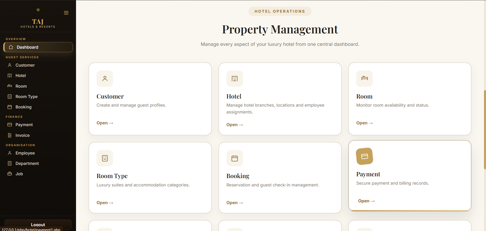

<div align="center">

# 🏨 Hotel Management System

### ✨ A Premium Full-Stack Hotel Management Web Application


<br>


---

---

# 📸 Hotel Dashboard Overview

<p align="center">
  <b>Luxury Hotel Management Dashboard</b><br><br>

  <table>
    <tr>
      <td align="center">
        
      </td>
    </tr>
    <tr>
      <td align="center">
        
      </td>
    </tr>
  </table>

</p>

---

### 🌐 Live Demo

🚀 **Coming Soon**

 

---

### 📂 GitHub Repository

https://github.com/Prannoybuilds/Hotel-Management-System

---

*A modern Hotel Management platform developed using PHP, MySQL, HTML, CSS and JavaScript with a luxury hospitality inspired interface.*

</div>

---

# 📖 Overview

The **Hotel Management System** is a complete web-based application developed to simplify and automate hotel operations.

The system enables hotel administrators to efficiently manage customers, rooms, bookings, employees, departments, invoices and payments through a centralized dashboard.

The project follows a client-server architecture where PHP handles the business logic, MySQL stores persistent data, Apache serves HTTP requests, and XAMPP provides the complete local development environment.

---

# 🎯 Objectives

✔ Digitalize hotel management

✔ Reduce manual paperwork

✔ Improve booking efficiency

✔ Store records securely

✔ Provide an intuitive web interface

✔ Perform reliable CRUD operations

---

# ✨ Core Features

🏨 Hotel Dashboard

👥 Customer Management

🛏 Room Management

📅 Booking Management

💳 Payment Module

🧾 Invoice Generation

🏢 Department Management

👨‍💼 Employee Management

🔍 Search Functionality

🔐 Login System

📊 Dynamic Reports

🗄 MySQL Database Integration

---

# 🛠 Tech Stack

| Category | Technology |
|-----------|------------|
| Frontend | HTML5 |
| Styling | CSS3 |
| Client-side | JavaScript |
| Backend | PHP |
| Database | MySQL |
| Web Server | Apache |
| Development Environment | XAMPP |
| Database Manager | phpMyAdmin |

---

# 🏗 System Architecture

```text
                     USER

                       │

                       ▼

          Google Chrome / Browser

                       │

                HTTP Request

                       │

                       ▼

             Apache Web Server
              (Running in XAMPP)

                       │

          Executes PHP Scripts

                       │

                       ▼

         Hotel Management System

                       │

            Business Logic Layer

                       │

               SQL Queries

                       │

                       ▼

             MySQL Database

                       │

          Returns Requested Data

                       │

                       ▼

           PHP Generates HTML

                       │

                       ▼

        HTML + CSS + JavaScript

                       │

                       ▼

                  USER
```

---

# 🔄 Complete Working Cycle

## ① User Request

The user opens the application using

```
http://localhost/PHP/hotel/
```

The browser generates an HTTP request.

---

## ② Apache Web Server

Apache (provided by XAMPP) receives the request.

Apache listens on:

```
http://localhost
```

or

```
127.0.0.1
```

When the requested resource is a PHP file, Apache forwards it to the PHP interpreter instead of sending the source code.

---

## ③ PHP Execution

The PHP engine executes the requested script.

Typical workflow:

```text
Receive Request

↓

Validate User Input

↓

Authenticate User

↓

Connect Database

↓

Execute SQL Query

↓

Process Data

↓

Generate HTML

↓

Return Response
```

---

## ④ Database Connection

The project establishes a connection using:

```php
$conn = mysqli_connect(
    "localhost",
    "root",
    "",
    "hotel"
);
```

Connection Details

| Property | Value |
|-----------|-------|
| Host | localhost |
| Username | root |
| Password | Blank (Default XAMPP) |
| Database | hotel |

---

## ⑤ MySQL Database

The MySQL database stores all hotel information including:

- Customer Records
- Room Details
- Bookings
- Employees
- Departments
- Payments
- Invoices

PHP communicates with MySQL using SQL commands:

```sql
SELECT
INSERT
UPDATE
DELETE
```

---

## ⑥ Response Generation

After executing SQL queries:

MySQL returns the requested records.

↓

PHP processes the retrieved data.

↓

Dynamic HTML pages are generated.

↓

CSS styles the interface.

↓

JavaScript provides client-side interaction.

↓

The browser displays the final webpage.

---

# 🌐 Complete Request Lifecycle

```text
User

↓

Browser

↓

Apache Server

↓

PHP Application

↓

Database Connection

↓

MySQL Database

↓

SQL Response

↓

PHP Rendering Engine

↓

HTML + CSS + JavaScript

↓

Browser

↓

User
```

---

# 📂 Project Structure

```text
Hotel-Management-System/

│

├── assets/
│   ├── banner.png
│   ├── screenshots/
│   └── icons/
│
├── css/
│   ├── style.css
│   └── form.css
│
├── database/
│   └── hotel.sql
│
├── docs/
│   ├── architecture.png
│   ├── workflow.png
│   ├── er-diagram.png
│   └── usecase.png
│
├── php/
│
├── README.md
│
├── LICENSE
│
└── .gitignore
```

---

# 📸 Application Preview

| Dashboard | Booking |
|------------|----------|
|  |  |

| Customers | Rooms |
|------------|--------|
|  |  |

| Invoice | Payment |
|----------|----------|
|  |  |

---

# 🚀 Installation

### Clone Repository

```bash
git clone https://github.com/Prannoybuilds/Hotel-Management-System.git
```

### Move Project

Place the folder inside:

```text
C:\xampp\htdocs\
```

### Start XAMPP

- Apache ✅
- MySQL ✅

### Import Database

Open **phpMyAdmin** and create a database named:

```text
hotel
```

Import:

```text
database/hotel.sql
```

### Run Application

Open:

```text
http://localhost/PHP/hotel/
```

---

# 📈 Future Enhancements

- 🌐 Cloud Deployment
- 💳 Payment Gateway Integration
- 📧 Email Notifications
- 📱 Responsive Mobile Dashboard
- 🔐 Role-Based Authentication
- 📊 Analytics Dashboard
- 🤖 AI-Based Room Recommendation
- 📅 Online Reservation Portal
- 📲 QR Code Check-In

---

# 👨‍💻 Developer

## Prannoy Sen

**B.Tech Computer Science Engineering**

Manipal University Jaipur

### GitHub

https://github.com/Prannoybuilds

### LinkedIn

(https://www.linkedin.com/in/prannoy-sen-3aa64b3a0/)

---

# 📜 License

This project is released for **educational, academic and portfolio purposes**.

---

<div align="center">

## ⭐ If you found this project useful, please consider giving it a Star!

### Crafted with ❤️ using PHP, MySQL & Apache

</div>
